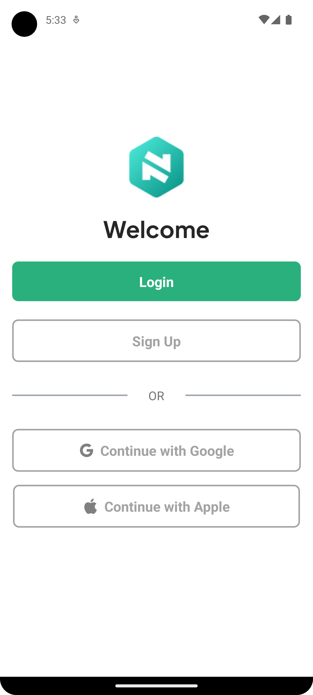
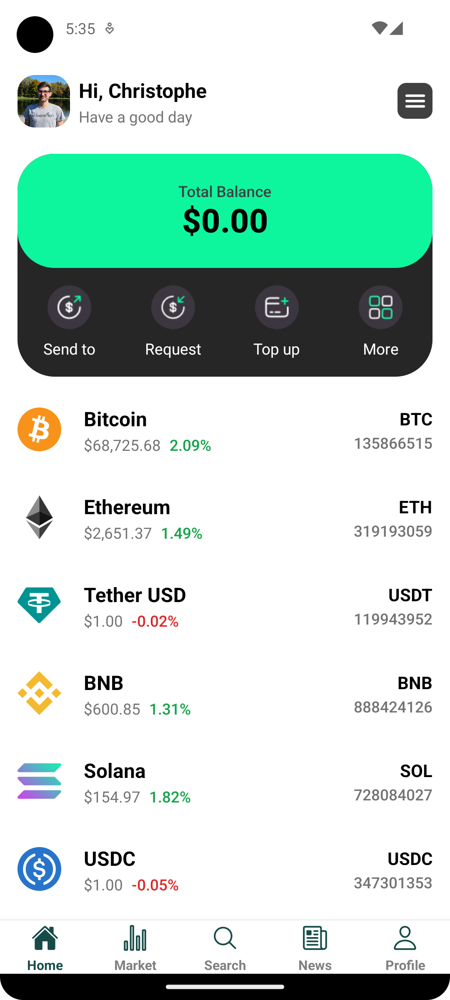
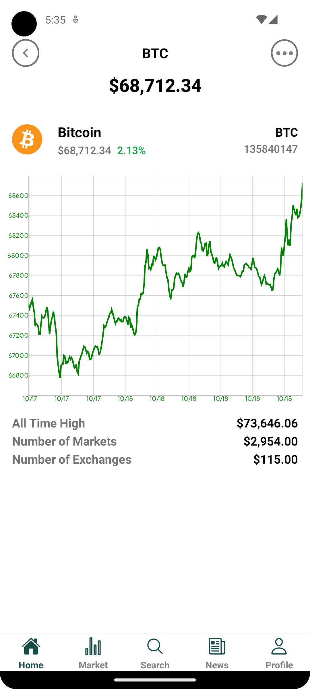
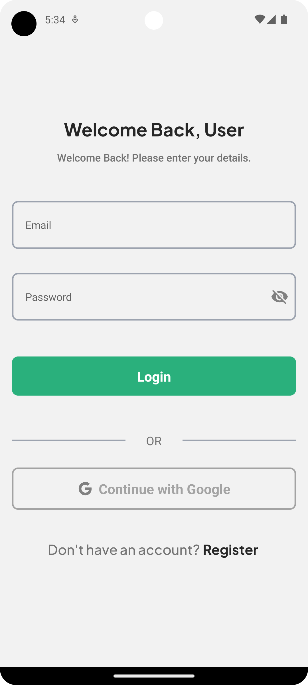

# React native crypto application

This mobile cryptocurrency app provides market price listings based on trade volume and market capitalization. It also lets you search for specific cryptocurrencies and stay updated with the latest crypto news. Designed for users interested in the cryptocurrency market and investments, the app offers real-time and historical data on market changes.


## Download

<a href="https://play.google.com/store/apps/details?id=com.cdcoding.fintechcrypto" target="_blank">

</a>


## Screenshots

<table>
   
<tr>
    <td>
    <p align="center">
      
    </p>
  </td>
    <td>
    <p align="center">
      
    </p>
  </td>
    <td>
    <p align="center">
      
    </p>
  </td>
   
<tr>
</tr>
  <td>
    <p align="center">
      
    </p>
  </td>
    <td>
    <p align="center">
      
    </p>
  </td>
    <td>
    <p align="center">
      
    </p>
  </td>
</tr>
</table>


## Technology stack
- React Native (ReactJS-based framework that can use native platform capabilities)
- Expo (framework and a platform for universal React applications)
- Tailwind (styling)

## Dependencies

- Axios (Javascript library used to make HTTP requests from node. js or XMLHttpRequests from the browser)
- React Navigation - (Routing and navigation)
- React native async storage
- Victory native
- React native reanimated
- React native safe area context
- Supabase

## Prerequisites

The following software is required to be installed on your system:
- Node 
- Npm 
- Expo

Type the following commands in the terminal to verify your node and npm versions
```bash
npm -v
node -v
expo -V
```
1. Clone the repo
```bash
git clone https://github.com/Christophe-DC/FintechCryptoApp.git
cd FintechCryptoApp
```
2. Install the dependencies
```bash
npm install
```
3. Start the application
```bash
expo start
```
4. Run the application on an iOS simulator
```bash
npm run ios
```
5. Run the application on an android simulator
```bash
  npm run android
```
